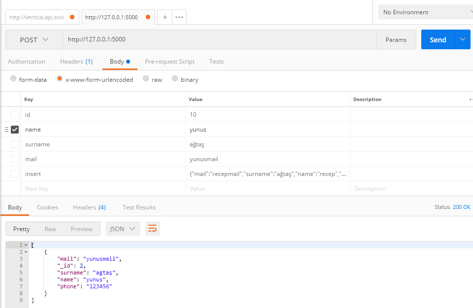

# pymongo-tutorial
This is flask and mongodb based simpe user information query api.

## Query

With HTTP POST method.

**List of POST Parameters**
* id
* name
* surname
* mail
* phone

## Insert data
Send POST with **insert** parameter: Json text containing *name, surname, mail, phone* data.

>{"mail":"yunus@mail.com","surname":"Agtas","name":"Yunus","phone":"123456"}

After, will return you inserted document id.
